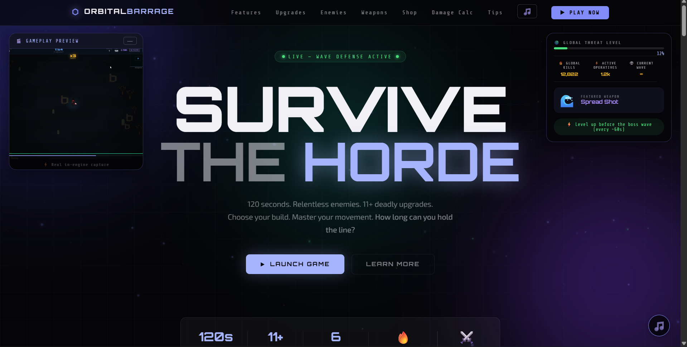
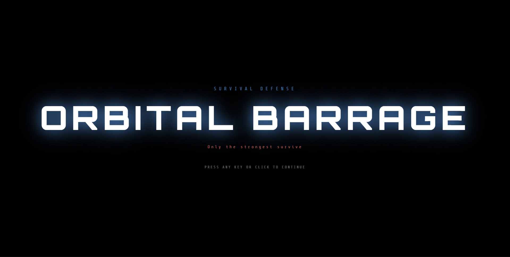
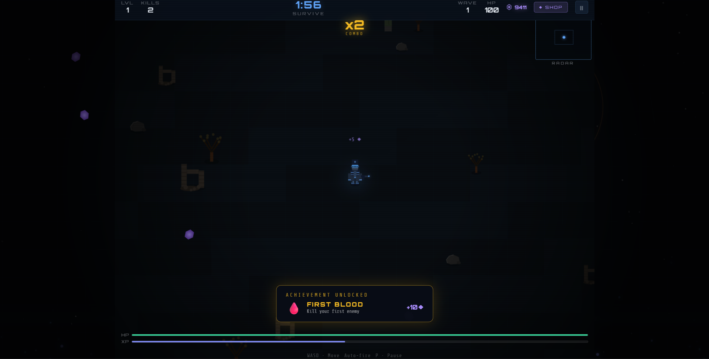
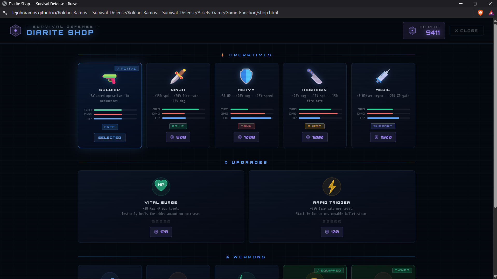

<div align="center">

# 🧟 SURVIVE THE HORDE

### *How long can you last?*


> A brutal browser‑based survival shooter. Endless waves of enemies keep coming —
> upgrade your arsenal, master your movement, and fight to survive.
> Play solo or team up with up to 4 friends in real‑time multiplayer.

</div>

---

## ⚡ Quick Start

For **single player**, just open `index.html` in any modern browser and click **START GAME** — no setup needed.

For **multiplayer**, install dependencies with `npm install`, then run the server with `node server.js` before launching the game.

---

## 🎮 Game Features

🎯 **Auto-targeting** — Bullets lock onto the nearest enemy automatically. Focus on staying alive.

📈 **Escalating Waves** — Every 15 seconds the wave increases, spawning faster and tougher enemies.

⚠️ **Boss Spawns** — A massive boss enemy appears every 60 seconds with 500+ HP and a screen-shaking entrance.

🔥 **Combo System** — Chain kills within 2.5 seconds to build your combo meter and maximize your score.

💎 **Diarite Shop** — Earn diarite from kills and spend it on permanent upgrades that carry over between runs.

🏆 **Achievements** — 12 hidden challenges with diarite rewards. Complete them all to unlock a secret weapon.

👥 **Multiplayer** — Team up with 2 to 4 players over WebSocket in real-time co-op survival.

---

## 🧬 Character Classes

Choose your operative before each run. Each class plays differently — pick the one that matches your style.

| | Character | Speed | HP | Damage | Fire Rate | Specialty |
|--|-----------|:-----:|:--:|:------:|:---------:|-----------|
| 🔫 | **Soldier** | ●●●○○ | ●●●○○ | ●●●○○ | ●●●○○ | Balanced — no weaknesses |
| 🗡️ | **Ninja** | ●●●●● | ●●○○○ | ●●○○○ | ●●●●○ | Fastest operative alive |
| 🛡️ | **Heavy** | ●●○○○ | ●●●●● | ●●●●○ | ●●○○○ | Built like a tank |
| 🔪 | **Assassin** | ●●●●○ | ●●○○○ | ●●●●● | ●●●○○ | Highest burst damage |
| 💉 | **Medic** | ●●●○○ | ●●●●○ | ●●●○○ | ●●●○○ | Heals over time · +20% XP gain |

> 💡 Additional characters can be unlocked in the Shop using diarite.

---

## 🔫 Arsenal

### 🟢 Starter Weapon

| Weapon | Style | Description |
|--------|-------|-------------|
| 🔫 **Basic Rifle** | Precision | Your default sidearm. Locks onto the nearest enemy automatically. Scales well with upgrades. |

---

### 🔵 Unlockable Weapons *(earned through level-up upgrades)*

| Weapon | Style | Description |
|--------|-------|-------------|
| 🌊 **Spread Shot** | Area | Fires 5 bullets in a wide arc simultaneously. Devastating in close quarters. |
| 🎯 **Sniper Rifle** | Piercing | Single high-velocity round dealing 3× damage that passes through multiple enemies. |
| 🔴 **Laser Beam** | Sustained | A continuous energy beam that melts enemies in a straight line as long as it fires. |
| 🚀 **Rocket Launcher** | Explosive | Homing rockets that track enemies and detonate on impact, dealing splash damage to all nearby foes. |
| 🔮 **Orbit Shield** | Defensive | Deploys 4 rotating energy orbs around you that deal contact damage to anything they touch. |

---

### 🟣 Secret Weapon

| Weapon | Unlock Condition | Description |
|--------|-----------------|-------------|
| ☢️ **Plasma Cannon** | Complete all achievements | Fires 3 massive piercing plasma orbs simultaneously. Each orb passes through every enemy it touches. Unlocked permanently once earned. |

---

## 🛒 Diarite Shop

**Diarite (◆)** is the in-game currency earned by killing enemies and completing achievements. It persists between runs and can be spent on permanent upgrades.

### 💀 How to Earn Diarite

| Kill Type | Reward |
|-----------|--------|
| Standard Kill | 5 ◆ |
| Splitter Kill | 10 ◆ |
| Shielded Kill | 12 ◆ |
| Elite Kill | 15 ◆ |
| Boss Kill | 50 ◆ |
| Achievement Bonus | Varies |

### 🛍️ What to Spend it On

| Upgrade | Effect |
|---------|--------|
| ❤️ HP Upgrade | Permanently increase your starting max HP |
| 🌀 Fire Rate Upgrade | Start every run with a faster base fire rate |
| 🔫 Weapon Unlocks | Begin a run with a specific weapon already equipped |
| 🧬 Character Unlocks | Unlock new character classes to play as |

---

## 📈 Upgrade Tree

Every time you level up, choose **1 of 3 random upgrades** from the pool below.

### Stat Upgrades

| Upgrade | Effect |
|---------|--------|
| ⚡ Swift Boots | +20% movement speed |
| 🔥 Power Strike | +50% bullet damage |
| 🌀 Rapid Fire | +30% fire rate |
| ✨ Multi-Shot | +1 extra projectile per shot |
| 💠 Big Bullet | +50% bullet size |
| 💚 Regeneration | +5 HP per second |
| ❤️ Fortify | +30 max HP and instant heal |

### Weapon Unlocks *(via upgrade)*

| Upgrade | Unlocks |
|---------|---------|
| 🌊 Spread Shot | 5-way spread fire |
| 🎯 Sniper Rifle | Piercing long-range shot |
| 🔴 Laser Beam | Continuous beam weapon |
| 🚀 Rocket Launcher | Homing explosive rockets |
| 🔮 Orbit Shield | 4 rotating contact-damage orbs |
| ☢️ Plasma Cannon | Secret — unlocked via achievements |

---

## 🏆 Achievements

There are **12 hidden achievements** tied to kills, waves, levels, combos, and survival time.

Each one rewards **diarite (◆)** and brings you one step closer to unlocking the secret **☢️ Plasma Cannon**.

> 🔒 Achievements are intentionally kept hidden. Discover them by playing.

---

## 🕹️ Controls

### ⌨️ Keyboard and Mouse

| Action | Input |
|--------|-------|
| Move | WASD or Arrow Keys |
| Auto-fire | On by default — targets nearest enemy automatically |
| Toggle manual fire | Press F to switch → then Left Click to aim and shoot |
| Pause / Resume | ESC or P |

### 📱 Mobile

| Action | Input |
|--------|-------|
| Move | Virtual joystick on the left side of the screen |
| Fire | Automatic — always enabled on mobile |
| Pause | On-screen pause button |

---

## 🚀 How to Play

### 🧍 Single Player

1. Open `index.html` in any modern browser
2. Select your character class from the menu
3. Click **START GAME**
4. Survive — the game ends when your HP hits zero, or you last the full 2 minutes

### 👥 Multiplayer *(2–4 players, self-hosted)*

1. Install dependencies:
```bash
   npm install
```
2. Start the WebSocket server — `node server.js`
3. Share your local IP address with your friends
4. Friends enter the IP in the **Multiplayer** menu in-game
5. Host selects difficulty and starts the match

> 🌐 All players must be on the same network, or the host must port-forward to play over the internet.

---

## 📁 Project Structure

| File / Folder | Purpose |
|---------------|---------|
| `index.html` | Landing and portal page |
| `game.html` | Main game page |
| `game.js` | Core game loop and all game logic |
| `shop.html` | Diarite shop interface |
| `server.js` | WebSocket server for multiplayer |
| `Assets_Game/` | Game assets, sounds, and functions |

---

## 🛠️ Built With

| Technology | Usage |
|------------|-------|
| HTML5 Canvas | Game rendering |
| Vanilla JavaScript | All game logic |
| CSS3 | UI and animations |
| WebSocket / Node.js | Multiplayer server |
| localStorage | Shop state, achievements, high scores |
| HTML5 Audio | Sound effects and music |
| Touch Events API | Mobile joystick support |

---

## 📸 Screenshots

### 🏠 Starting Page


### 📋 Loading Page


### 🎮 Play Page


### ⚔️ In-Game Action


### 🛒 Shop Page


---

<div align="center">

**Made with ☕ and way too many late nights**

*Good luck, operative. The horde never stops.*

</div>